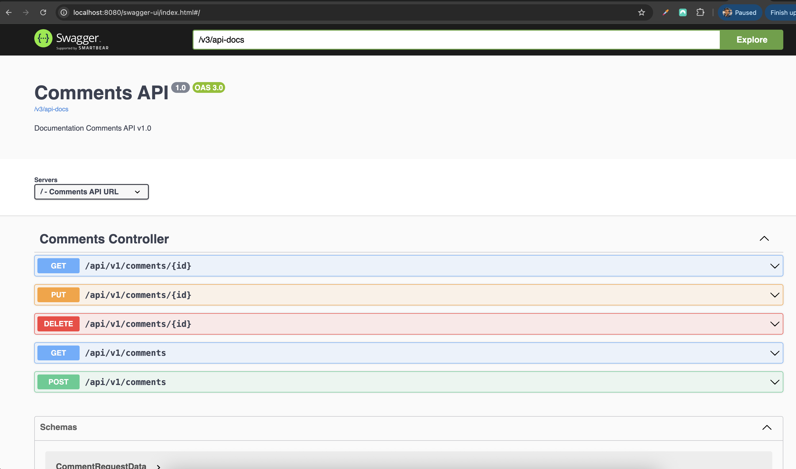

# Project Title

Welcome to the **Comments API**! This project provides a comprehensive API for managing comments. Below, you'll find all the necessary details to get started.

---

## 📄 Swagger Documentation

Access the Swagger UI for API documentation and testing:

**URL:** [http://localhost:8080/swagger-ui/index.html](http://localhost:8080/comments/swagger-ui/index.html)

---

## 📸 Preview

<div align="center">
    <div style="display: grid; grid-template-columns: repeat(3, 1fr); gap: 20px; margin: 20px 0;">
        <div>
            
        </div>
    </div>
</div>

---

## 🚀 Getting Started

### Prerequisites

- Java 11 or higher
- Maven or Gradle
- Docker (optional, for containerized deployment)

### Installation

Clone the repository:

```bash
git clone https://github.com/jeetparmar/comments-api.git
cd comments-api
```

Build and run the project:

```bash
mvn clean install
mvn spring-boot:run
```

Or using Docker:

```bash
docker build -t comments-api .
docker run -p 8080:8080 comments-api
```

## 🛠 Features
- RESTful API: Provides endpoints for managing comments.
- Swagger Integration: Interactive API documentation.
- CRUD Operations: Create, Read, Update, and Delete comments.
- Error Handling: Comprehensive error responses for invalid requests.
- Pagination & Sorting support on list endpoints.
- Easy to extend and integrate.

## 📂 Project Structure
```bash
comments-api/
├── src/
│   ├── main/
│   │   ├── java/          # Application source code
│   │   ├── resources/     # Configuration files
│   └── test/              # Unit and integration tests
├── docs/                  # Documentation assets
└── README.md              # Project documentation
```

## 📦 API Endpoints
```bash
| Method | Endpoint                | Description              |
| ------ | ----------------------- | ------------------------ |
| GET    | `/api/v1/comments`      | List all comments        |
| GET    | `/api/v1/comments/{id}` | Retrieve a comment by ID |
| POST   | `/api/v1/comments`      | Create a new comment     |
| PUT    | `/api/v1/comments/{id}` | Update a comment by ID   |
| DELETE | `/api/v1/comments/{id}` | Delete a comment by ID   |
```

## 🤝 Contributing
Contributions are welcome! To contribute:

- Fork the repository.
- Create a new branch for your feature:

```bash
git checkout -b feature-name
```
- Commit your changes and push the branch:

```bash
git push origin feature-name
```
- Open a pull request.
